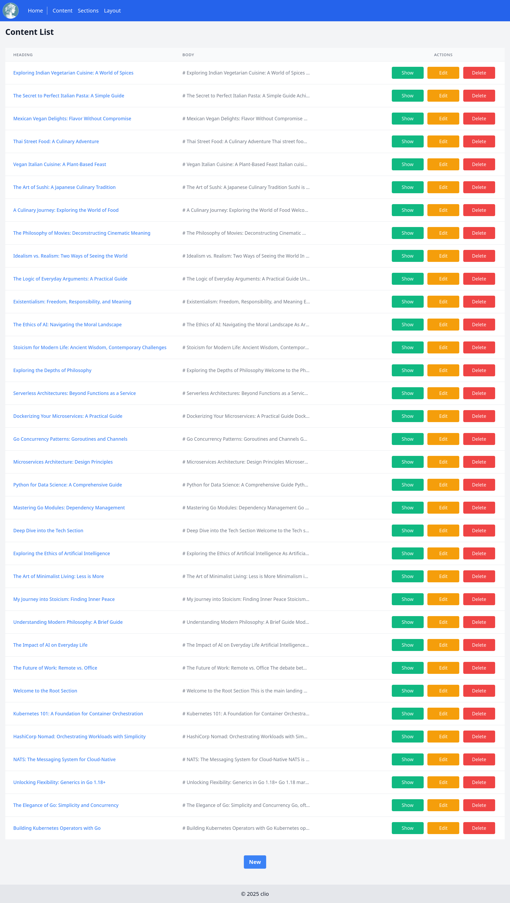

# Clio

Clio is (will be) a lightweight static site generator (SSG) written in Go.  
It is currently under development and aims to provide a simple, direct workflow for creating and publishing static content without unnecessary complexity.

Clio takes inspiration from [Hermes](https://github.com/adrianpk/hermes), a full-fledged web application framework with features like multi-user support, roles, and permissions. Clio, in contrast, is a lighter, local web application designed for single-user access directly from the machine it runs on. It does not depend on authentication or security layers, and its goal is to provide an almost instant way to put content online through a free platform such as GitHub Pages.

## Features in development

- Edit content in Markdown and automatically generate HTML.  
- Version control for both the source Markdown and the generated content (initially targeting GitHub Pages).  
- Database-backed: content, layouts, and sections are managed and catalogued in a DB.  
- Draft importing for those who prefer writing in their own editor and then importing the text.  
- Section support: each section has its own path (`/section-name`), with the root path as the main section.  
- Customizable layout per section, with sensible defaults for those who prefer not to provide templates.  
- Frontmatter support: metadata in Markdown is used for indexing in the DB on import, and preserved on export so Clio instances can be regenerated from Markdown files alone.  
- Content tagging. 
- Multiple content types with contextual features:  
  - **Pages**: content units with an open purpose, more oriented toward structure or general communication. They don’t necessarily follow a narrative or editorial logic, but instead provide a flexible container for different kinds of information.  
  - **Articles**: content units with a discursive intent, meant to be read as complete pieces, whether essay, commentary, narrative, or reflection  
  - **Blog**: chronologically organized content; both root and sections can have their own blog (`/blog`, `/section-name/blog`).  
  - **Series**: ordered posts that form a sequence (guides, tutorials, multi-part essays), with automatic navigation links backward/forward within the series.  
- Contextual blocks: each content type will allow attaching context-aware blocks to reference related content, filtered by type, section, or multi-section configuration.  
- Preview of the generated site before publishing.  
- Publication of generated content (with GitHub Pages as the first supported target).  
- More to come.