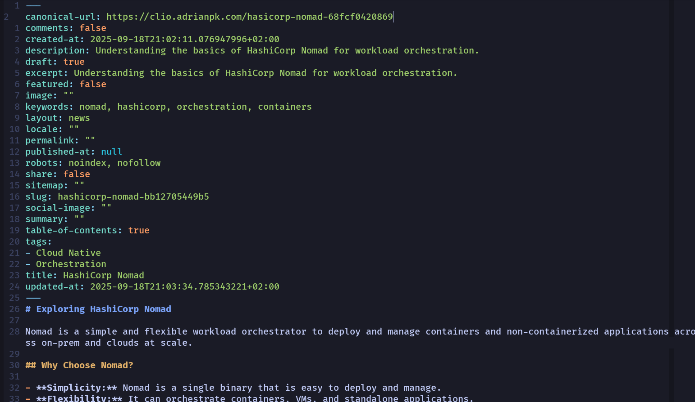
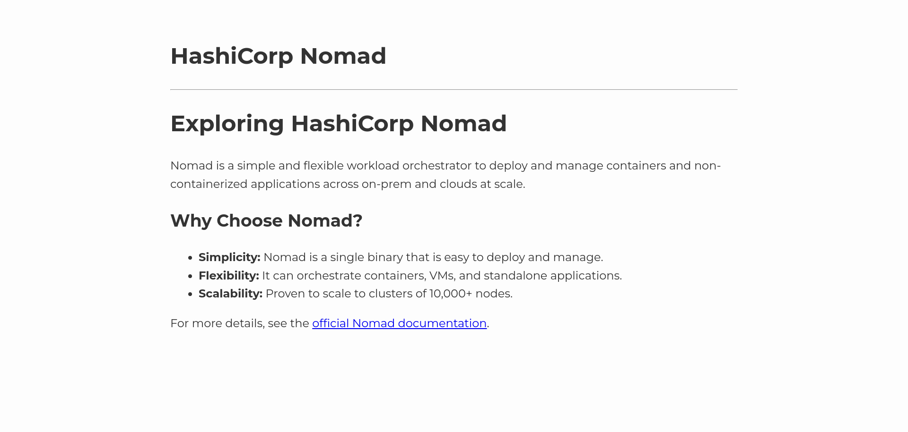

# Content Management Gallery

This gallery showcases the content management features of Clio.

## Content List

The main view for listing all the content available in the system.

## New/Edit Content

The view for creating and editing content. It features a side-by-side markdown editor and preview, as well as fields for metadata like section, author, and tags.

## Metadata Editor

A dedicated modal for editing content metadata, including publishing status, SEO fields, and other settings.

## Zen Mode

A distraction-free writing environment that focuses solely on the markdown editor.

## Generated Markdown

An example of a generated markdown file, including the YAML frontmatter created from the content's metadata.

## Generated HTML

The first version of a generated HTML page, using a minimalist layout. This view is a clean first step, but it's still missing the main navigation menu and the companion blocks for further navigation.

