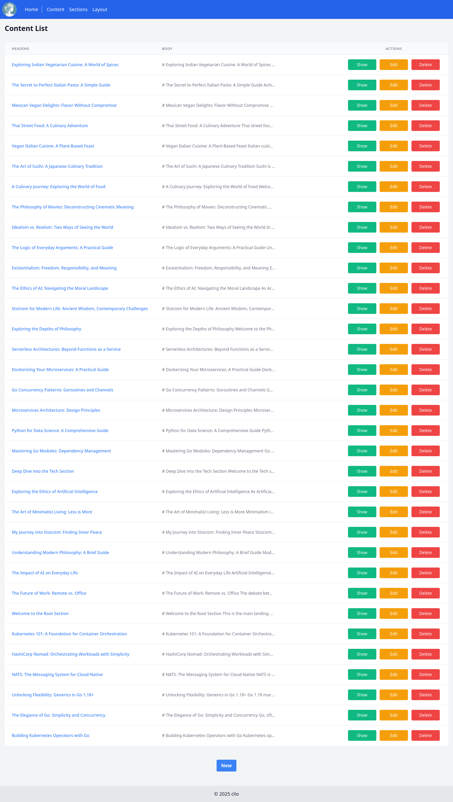
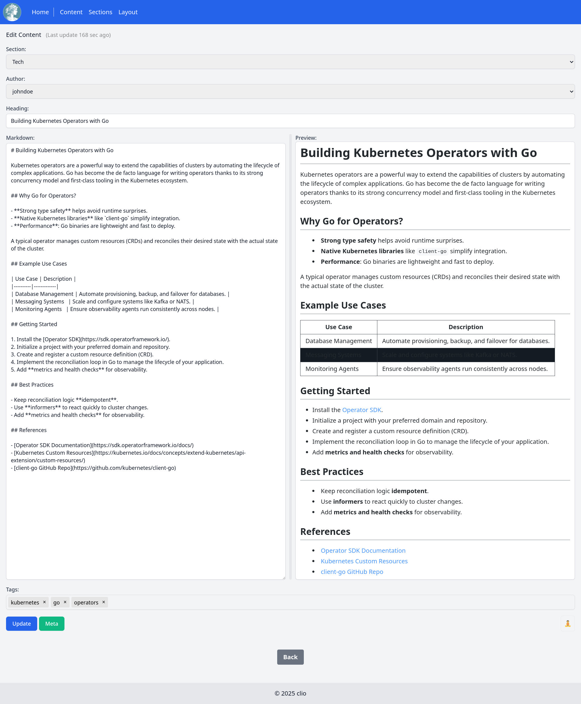
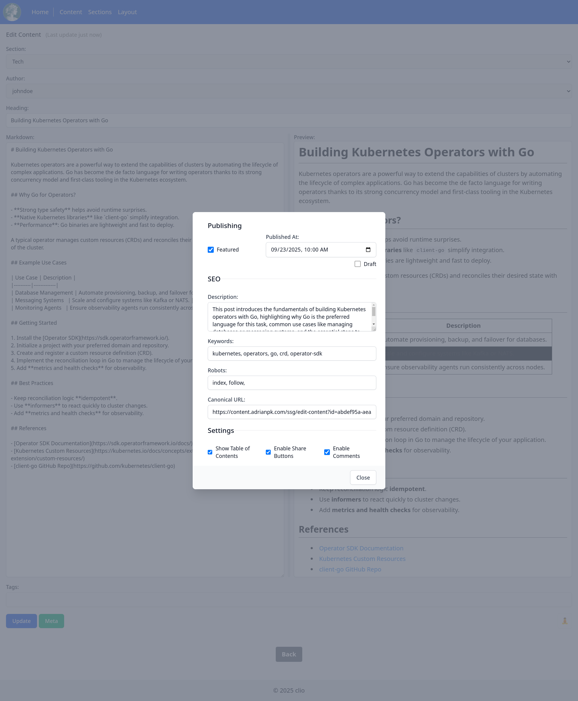
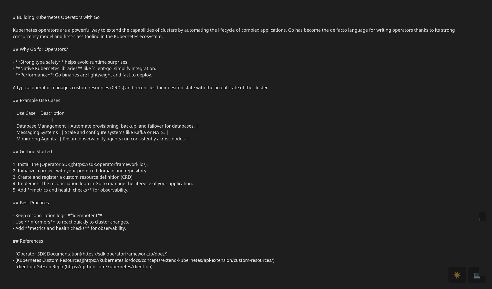

# Content Management Gallery

This gallery showcases the content management features of Clio.

## Content List

The main view for listing all the content available in the system.

## New/Edit Content

The view for creating and editing content. It features a side-by-side markdown editor and preview, as well as fields for metadata like section, author, and tags.

## Metadata Editor

A dedicated modal for editing content metadata, including publishing status, SEO fields, and other settings.

## Zen Mode

A distraction-free writing environment that focuses solely on the markdown editor.

## Generated Markdown

An example of a generated markdown file, including the YAML frontmatter created from the content's metadata.

---

# Header Styles Gallery

This section showcases the different header styles available in Clio.

## "Stacked" Style

The default style. The title is rendered below the image.

---

## "Overlay" Style

The title is rendered in white text centered directly on top of the image, with a dark scrim to ensure contrast.

---

## "Boxed" Style (Frosted Glass)

The title is rendered inside a frosted-glass effect stripe at the bottom of the image.

---

## "Text-Only" Style

A minimalist style with no header image, showing only the title.

